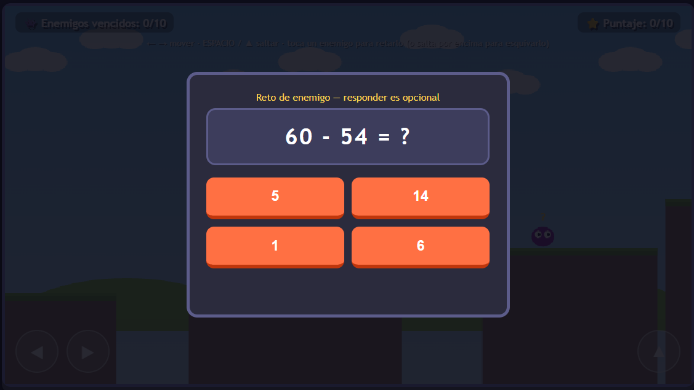

# 🎮 CALCULANDIA

## 📝 Descripción

Este videojuego educativo está relacionado con el aprendizaje y práctica de **operaciones aritméticas** mediante una experiencia interactiva y entretenida.

## 🎯 Objetivo del jugador

El objetivo principal del jugador es **completar 10 preguntas de operaciones aritméticas, responder correctamente y obtener la mayor puntuación posible sobre 10**.

## 🕹️ Mecánica principal

La mecánica principal consiste en **resolver preguntas de operaciones aritméticas y seleccionar una respuesta entre 4 alternativas**. Cada respuesta correcta otorga 1 punto y el juego informa al jugador si su respuesta es correcta o incorrecta.

## 🎲 Género

- Plataformas
- Trivia educativa
- Arcade educativo

## ⌨️ Controles

- `MOUSE` - Interacción
- `CLICK` - Seleccionar una respuesta

## 💻 Tecnologías utilizadas

- HTML5
- CSS3
- JavaScript
- IA generativa mediante prompts

## 📸 Capturas de pantalla

### Inicio

### Gameplay

### Gameplay adicional

## 🖥️ Plataforma

- Navegador web (prototipo HTML)
- Estado: **Prototipo funcional**

## 🤖 Uso de IA

Se utilizó inteligencia artificial generativa mediante prompts para **apoyar la creación y mejora del prototipo**, incluyendo la generación inicial del videojuego y la corrección de problemas relacionados con la puntuación, las alternativas de respuesta, las divisiones y el reinicio de la partida.

## 📚 Lo que aprendí

Durante el desarrollo aprendí a **transformar los requisitos de un videojuego educativo en un prototipo funcional**, diseñar preguntas con diferentes operaciones aritméticas, implementar un sistema de puntuación y utilizar la IA generativa para mejorar el videojuego mediante diferentes iteraciones.

## 🔧 Mejoras futuras

En una siguiente versión mejoraría **la complejidad de las preguntas**, incorporando desafíos más variados y aumentando progresivamente la dificultad para que el juego resulte más interesante y educativo para los estudiantes.

## ▶️ Jugar

[🎮 Abrir videojuego](calculandia.html)