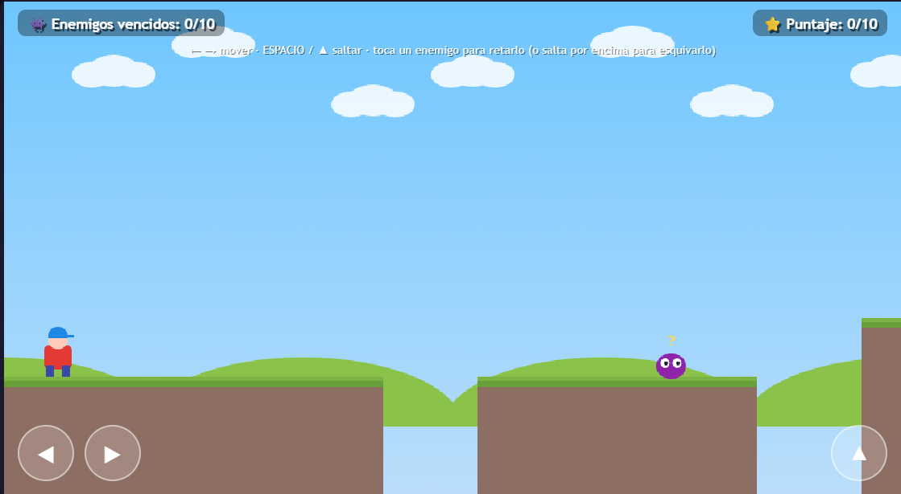

# 🎮 NOMBRE DEL VIDEOJUEGO

## 📝 Descripción

Este videojuego aborda el tema de ____________ mediante una experiencia interactiva.

## 🎯 Objetivo del jugador

El objetivo principal del jugador es ____________.

## 🕹️ Mecánica principal

La mecánica principal consiste en ____________.

## 🎲 Género

- Arcade
- Educativo

## ⌨️ Controles

- `WASD` - Movimiento
- `SPACE` - Acción / Saltar
- `MOUSE` - Interacción
- `CLICK` - Seleccionar

## 💻 Tecnologías utilizadas

- HTML5
- CSS3
- JavaScript

## 📸 Capturas de pantalla

### Inicio

### Gameplay

## 🤖 Uso de IA

Se utilizó inteligencia artificial como apoyo en ____________.

## 📚 Lo que aprendí

Durante el desarrollo aprendí ____________.

## 🔧 Mejoras futuras

En una siguiente versión mejoraría ____________.

## ▶️ Jugar

[🎮 Abrir videojuego](NOMBRE.html)