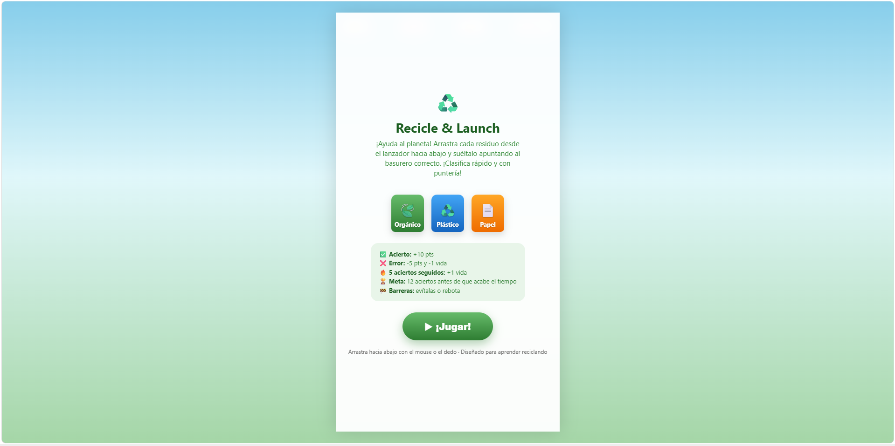
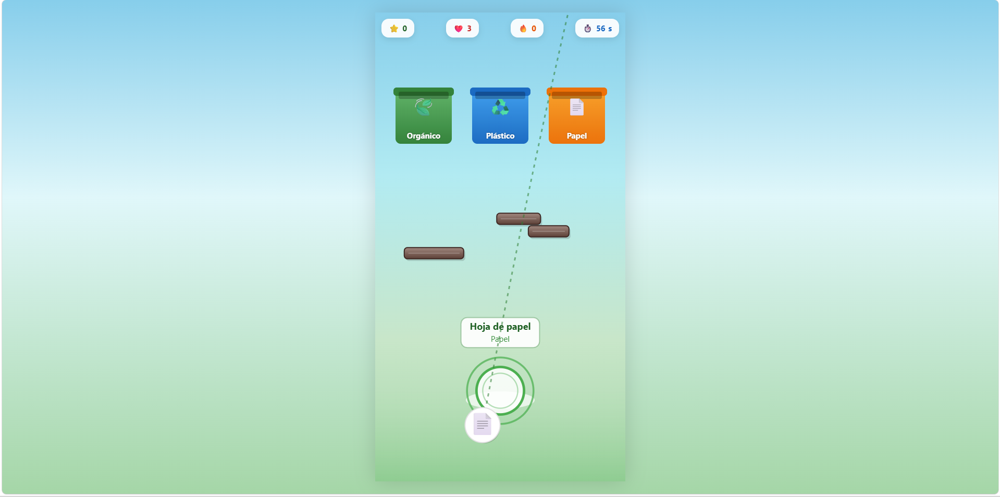
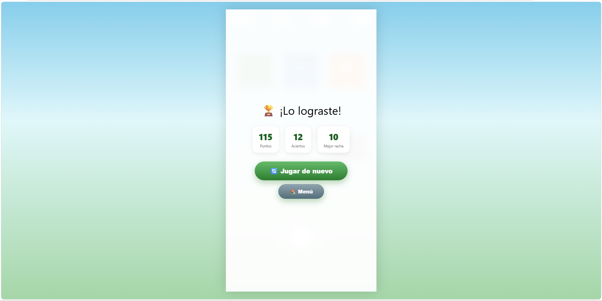
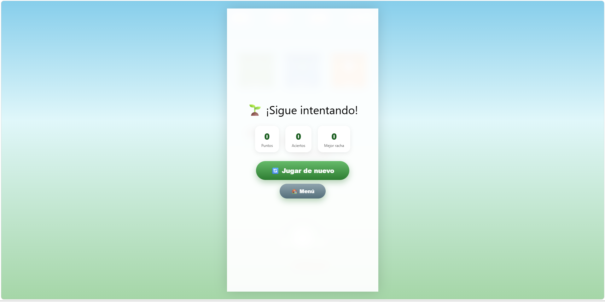

# ♻️ RECYCLE & LAUNCH

## 📝 Descripción

Este videojuego educativo está relacionado con el **reciclaje y la correcta separación de residuos** mediante una experiencia interactiva y entretenida.

## 🎯 Objetivo del jugador

El objetivo principal del jugador es **aprender a separar correctamente los residuos reciclables y completar los desafíos del videojuego para alcanzar un resultado favorable**.

## 🕹️ Mecánica principal

La mecánica principal consiste en **interactuar con los residuos y tomar decisiones relacionadas con su correcta clasificación y reciclaje**. El jugador debe aplicar sus conocimientos para avanzar y evitar decisiones incorrectas.

## 🎲 Género

- Educativo
- Arcade
- Aventura

## ⌨️ Controles

- `MOUSE` - Interacción
- `CLICK` - Seleccionar opciones e interactuar

## 💻 Tecnologías utilizadas

- HTML5
- CSS3
- JavaScript
- IA generativa mediante prompts

## 📸 Capturas de pantalla

### Inicio

### Gameplay

### Final bueno

### Final malo

## 🖥️ Plataforma

- Navegador web (prototipo HTML)
- Estado: **Prototipo funcional**

## 🤖 Uso de IA

Se utilizó inteligencia artificial generativa mediante prompts para **apoyar la creación y desarrollo del prototipo**, incluyendo la generación del código y la construcción de la experiencia interactiva relacionada con el reciclaje.

## 📚 Lo que aprendí

Durante el desarrollo aprendí a **aplicar un problema educativo al diseño de un videojuego**, organizar sus elementos principales y utilizar herramientas de IA generativa para construir un prototipo funcional.

## 🔧 Mejoras futuras

En una siguiente versión mejoraría **la variedad de desafíos, la cantidad de residuos y las situaciones de reciclaje**, además de incorporar nuevos niveles y una mayor dificultad progresiva.

## ▶️ Jugar

[♻️ Abrir videojuego](RecicleLaunch.html)