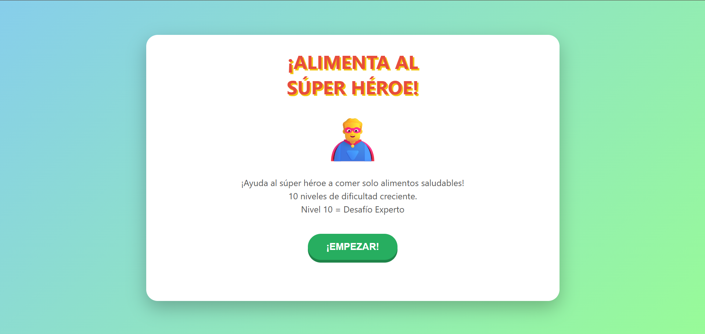
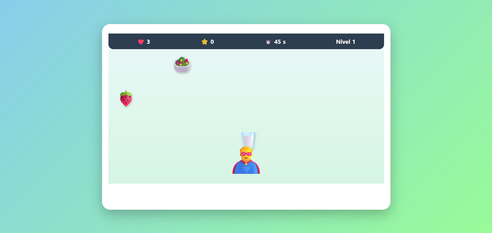
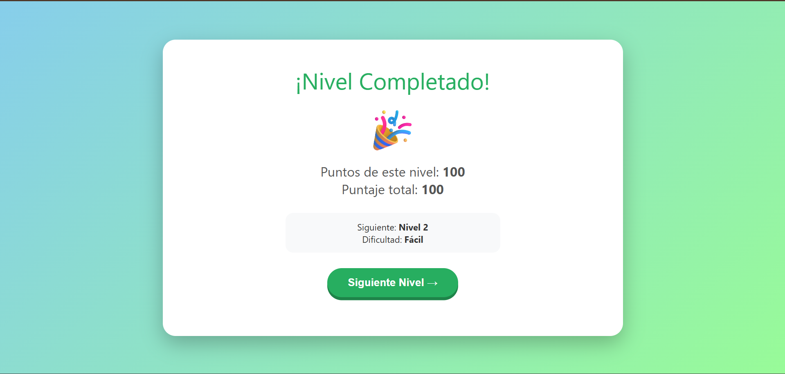

# 🥗 ¡ALIMENTA AL SÚPER HÉROE! &nbsp; 

## 📝 Descripción

Este videojuego educativo está relacionado con la **alimentación saludable** mediante una experiencia interactiva, divertida y colorida.

## 🎯 Objetivo del jugador

El objetivo principal del jugador es **seleccionar correctamente los alimentos saludables para alimentar al personaje y conseguir la mayor cantidad de puntos posible**.

## 🕹️ Mecánica principal

La mecánica principal consiste en **seleccionar alimentos saludables que aparecen en pantalla**, evitando aquellos que no sean recomendables. Las elecciones correctas permiten conseguir puntos y avanzar hacia el objetivo del juego.

## 🎲 Género

- Arcade
- Educativo

## ⌨️ Controles

- `MOUSE` - Interacción
- `CLICK` - Seleccionar alimentos

## 💻 Tecnologías utilizadas

- HTML5
- CSS3
- JavaScript
- IA generativa mediante prompts

## 📸 Capturas de pantalla

### Inicio

### Gameplay

### Resultado final

## 🖥️ Plataforma

- Navegador web (prototipo HTML)
- Estado: **Prototipo funcional**

## 🤖 Uso de IA

Se utilizó inteligencia artificial generativa mediante prompts para **apoyar la creación del prototipo y su estructura funcional**, aplicando los requisitos definidos para enseñar a elegir alimentos saludables.

## 📚 Lo que aprendí

Durante el desarrollo aprendí a **aplicar el concepto de mecánica de juego y género arcade a un objetivo educativo**, además de desarrollar una experiencia que utiliza interacción y retroalimentación para enseñar sobre alimentación saludable.

## 🔧 Mejoras futuras

En una siguiente versión mejoraría **la cantidad de niveles, la variedad de alimentos y la dificultad**, incorporando nuevos desafíos y más elementos de interacción.

## ▶️ Jugar

[🥗 Abrir videojuego](game3.html)
