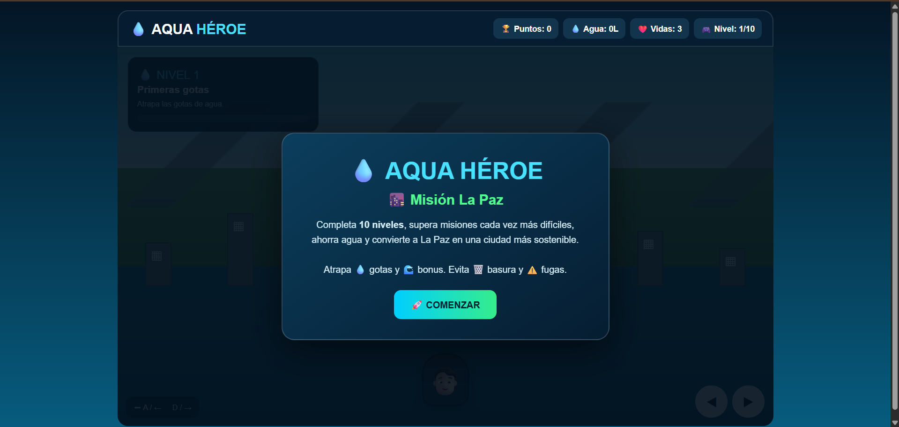
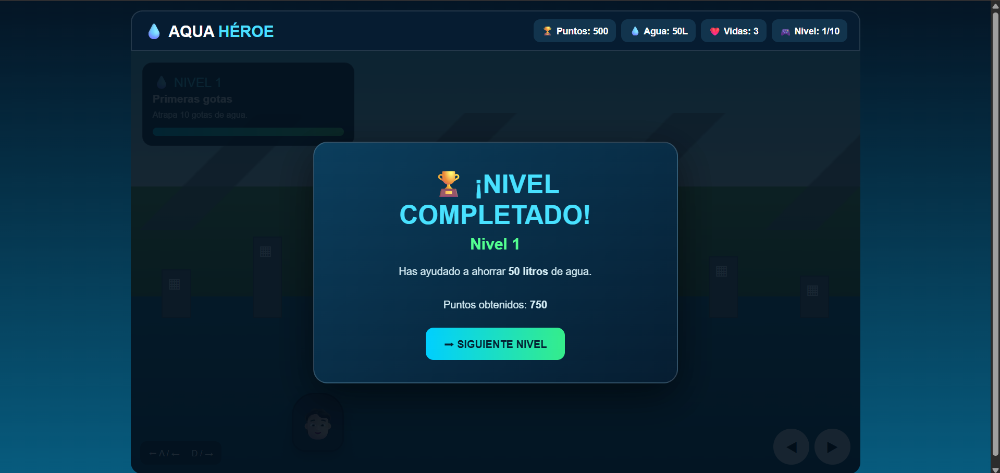

# 💧 MISIÓN GOTA: RETO POR EL AGUA &nbsp; 

## 📝 Descripción

Este videojuego educativo está relacionado con el **cuidado y ahorro responsable del agua**, utilizando una experiencia interactiva para motivar a los jugadores a reflexionar sobre sus hábitos de consumo.

## 🎯 Objetivo del jugador

El objetivo principal del jugador es **administrar correctamente el agua, completar los retos de ahorro y conseguir la mayor cantidad de puntos y progreso posible**.

## 🕹️ Mecánica principal

La mecánica principal consiste en **tomar decisiones relacionadas con el uso del agua y administrar una reserva limitada**, obteniendo puntos y recompensas mediante acciones correctas de ahorro.

## 🎲 Género

- Educativo
- Simulación
- Estrategia

## ⌨️ Controles

- `MOUSE` - Interacción
- `CLICK` - Seleccionar opciones y realizar acciones

## 💻 Tecnologías utilizadas

- HTML5
- CSS3
- JavaScript
- IA generativa mediante prompts

## 📸 Capturas de pantalla

### Inicio

### Gameplay

### Resultado

## 🖥️ Plataforma

- Navegador web (prototipo HTML)
- Estado: **Prototipo funcional**

## 🤖 Uso de IA

Se utilizó inteligencia artificial generativa mediante prompts para **apoyar el diseño y desarrollo del prototipo**, incluyendo la construcción de la estructura del videojuego y la implementación de sus elementos interactivos.

## 📚 Lo que aprendí

Durante el desarrollo aprendí a **utilizar el concepto de Player Persona para orientar el diseño de un videojuego**, relacionando las motivaciones y hábitos del jugador objetivo con las mecánicas y objetivos del juego.

## 🔧 Mejoras futuras

En una siguiente versión mejoraría **la cantidad de retos, el sistema de recompensas y la progresión**, incorporando más situaciones relacionadas con el ahorro de agua y nuevos niveles de dificultad.

## ▶️ Jugar

[💧 Abrir videojuego](game4.html)
