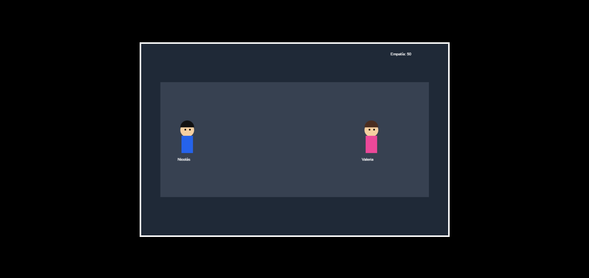
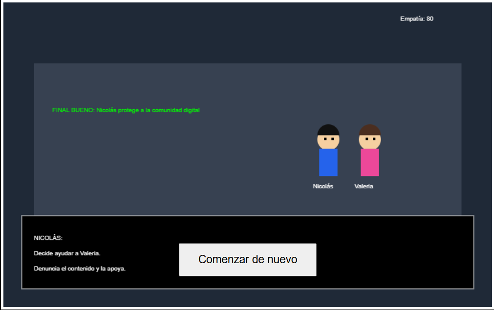
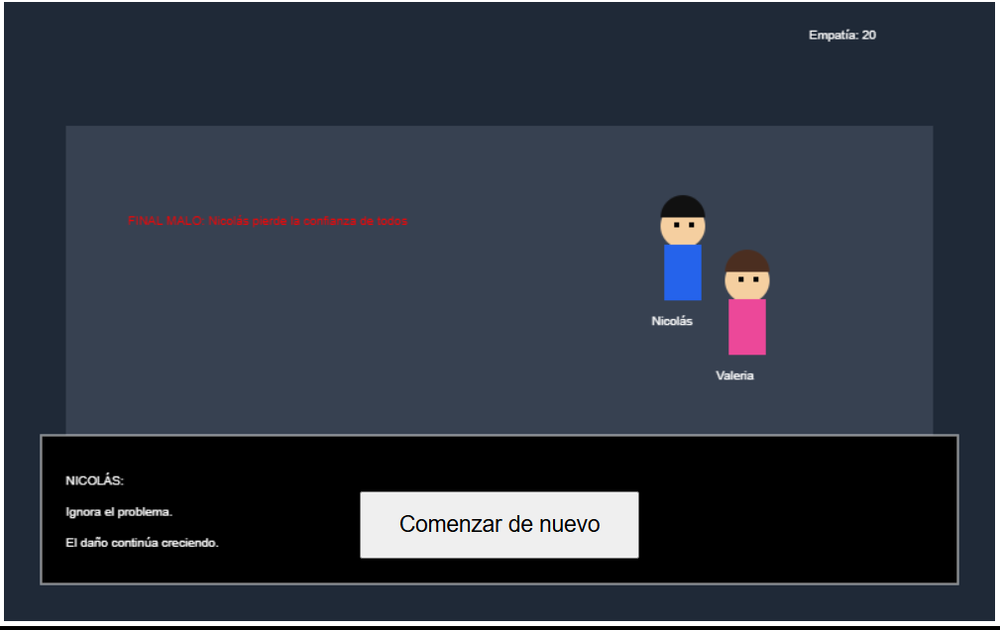

# 🌐 ECOS EN LA RED RPG &nbsp; 

## 📝 Descripción

Este videojuego está relacionado con el **acoso escolar digital o ciberbullying** y presenta una experiencia narrativa destinada a ayudar al jugador a comprender las consecuencias de sus acciones en las redes sociales.

## 🎯 Objetivo del jugador

El objetivo principal del jugador es **avanzar por la historia y comprender el impacto que pueden tener las acciones realizadas en un entorno digital sobre otras personas**.

## 🕹️ Mecánica principal

La mecánica principal consiste en **avanzar mediante escenas y situaciones narrativas que muestran las consecuencias de las decisiones y acciones del personaje**, permitiendo que el jugador comprenda el problema a través de la experiencia.

## 🎲 Género

- RPG
- Aventura
- Narrativa
- Educativo

## ⌨️ Controles

- `MOUSE` - Interacción
- `CLICK` - Avanzar e interactuar

## 💻 Tecnologías utilizadas

- HTML5
- CSS3
- JavaScript
- IA generativa mediante prompts

## 📸 Capturas de pantalla

### Inicio

### Gameplay

### Escena narrativa

## 🖥️ Plataforma

- Navegador web (prototipo HTML)
- Estado: **Prototipo funcional**

## 🤖 Uso de IA

Se utilizó inteligencia artificial generativa mediante prompts para **apoyar la construcción del storytelling, la generación del prototipo y el desarrollo de los elementos narrativos del videojuego**.

## 📚 Lo que aprendí

Durante el desarrollo aprendí a **aplicar storytelling en videojuegos, construir un arco de personaje y utilizar el principio de "show don't tell" para transmitir un mensaje mediante las acciones y consecuencias de la historia**.

## 🔧 Mejoras futuras

En una siguiente versión mejoraría **la cantidad de escenas, la profundidad de las decisiones del jugador y la interacción narrativa**, incorporando más situaciones y diferentes consecuencias.
