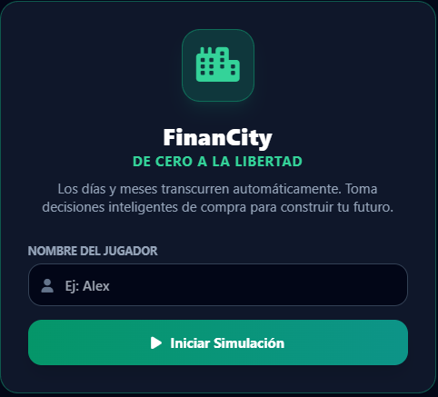
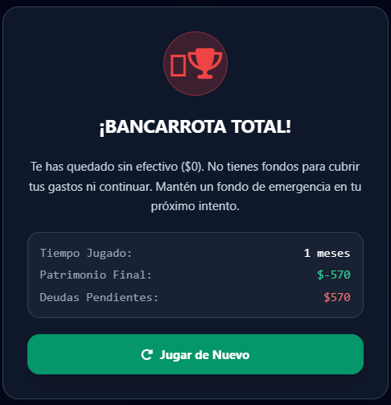

# 💰 FINANCITY: DE CERO A LA LIBERTAD

## 📝 Descripción

Este videojuego educativo está relacionado con el **uso responsable del dinero y la educación financiera**, mediante una experiencia de simulación en la que el jugador debe tomar decisiones sobre sus recursos económicos.

## 🎯 Objetivo del jugador

El objetivo principal del jugador es **mejorar progresivamente su situación económica, administrar sus ingresos y gastos, reducir sus deudas y alcanzar la libertad financiera**.

## 🕹️ Mecánica principal

La mecánica principal consiste en **gestionar recursos y tomar decisiones financieras durante diferentes etapas de la vida del personaje**, equilibrando ingresos, gastos, deudas, ahorro, inversiones, salud y felicidad.

## 🎲 Género

- Simulación
- Incremental
- Educativo
- Idle Tycoon

## ⌨️ Controles

- `MOUSE` - Interacción
- `CLICK` - Seleccionar opciones y tomar decisiones

## 💻 Tecnologías utilizadas

- HTML5
- CSS3
- JavaScript
- IA generativa mediante prompts

## 📸 Capturas de pantalla

### Inicio

### Gameplay

### Resultado

## 🖥️ Plataforma

- Navegador web (prototipo HTML)
- Estado: **Prototipo funcional**

## 🤖 Uso de IA

Se utilizó inteligencia artificial generativa mediante prompts para **apoyar la creación del prototipo funcional**, utilizando como base el Game Design Document (GDD), sus mecánicas, reglas, progresión y condiciones de victoria y derrota.

## 📚 Lo que aprendí

Durante el desarrollo aprendí a **utilizar un Game Design Document como base para definir un videojuego**, relacionando el concepto, las mecánicas, las reglas, la progresión y las condiciones de victoria y derrota con el prototipo funcional.

## 🔧 Mejoras futuras

En una siguiente versión mejoraría **la variedad de decisiones financieras, la progresión, los eventos y los escenarios**, incorporando más situaciones de la vida cotidiana y nuevos desafíos económicos.

## ▶️ Jugar

[💰 Abrir videojuego](game6.html)