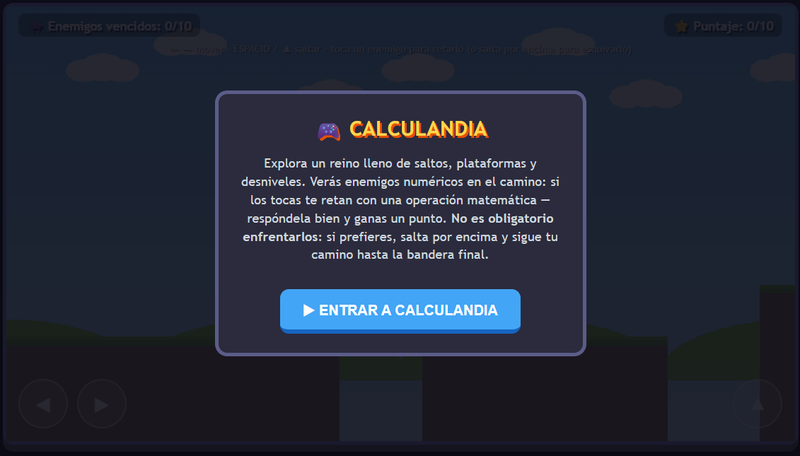
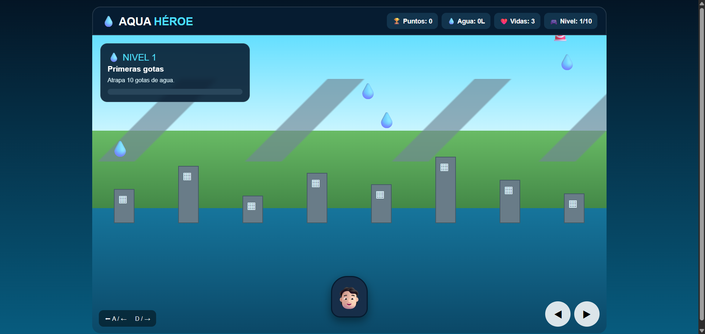
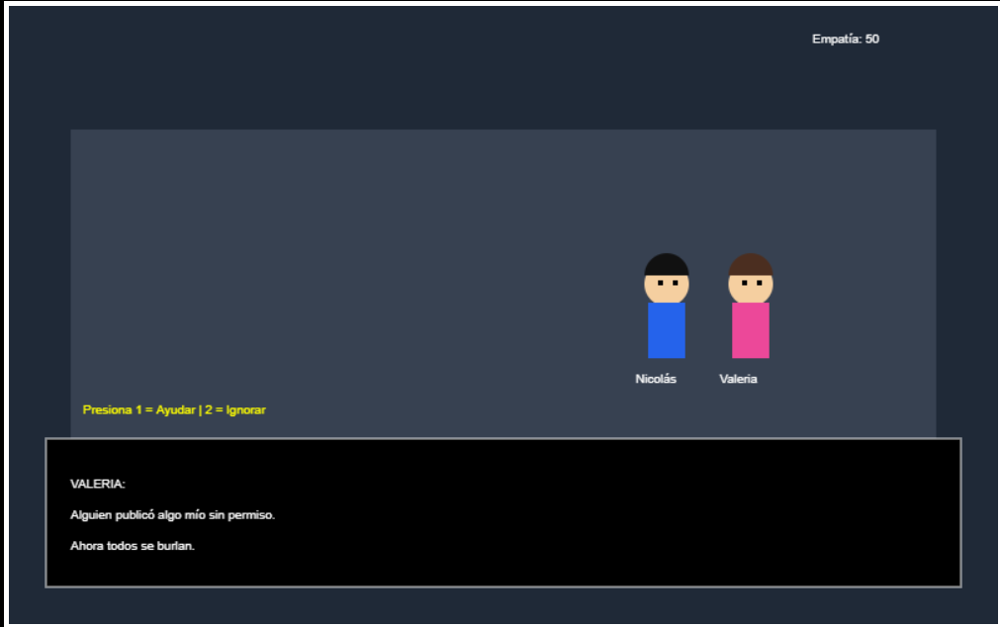
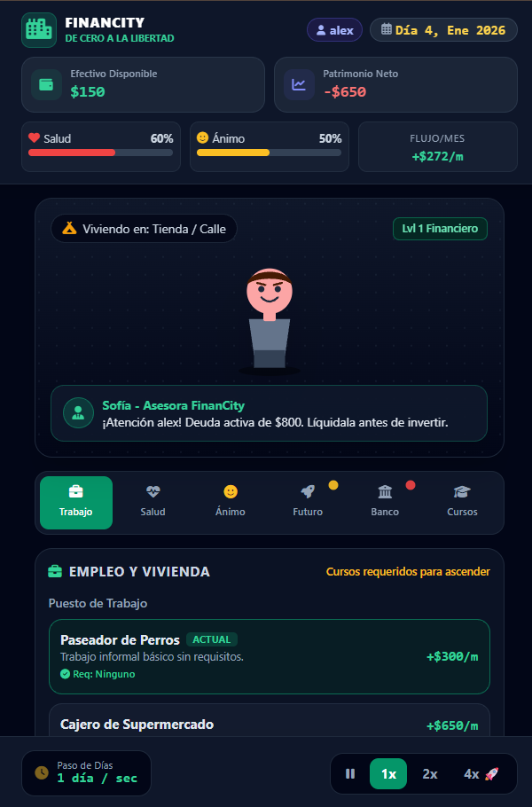

# 🎮 Jheremy Ramírez | Game Development Portfolio

> **Portafolio personal de desarrollo de videojuegos**  
> Prototipos interactivos creados durante la asignatura de **Game Development**.

[](#)
[](#)
[](#)
[](#)
[](#)

---

## 👨‍💻 Sobre mí

Soy **Jheremy Ramírez**, estudiante interesado en el desarrollo de videojuegos, la programación y el diseño de experiencias interactivas.

Este repositorio reúne una selección de los **prototipos y videojuegos desarrollados durante las primeras clases de Game Development**, mostrando diferentes géneros, mecánicas y objetivos educativos.

Mi objetivo con este portafolio es demostrar no solamente el resultado final, sino también mi proceso de aprendizaje: **idear → diseñar → programar → probar → corregir → mejorar**.

---

## 🕹️ Mis proyectos

| # | Videojuego | Género | Tema principal | Jugar |
|---|---|---|---|---|
| 01 | 🧮 **Calculandia** | Trivia / Arcade educativo | Operaciones matemáticas | [Ver proyecto](01-calculandia/) |
| 02 | ♻️ **Recycle & Launch** | Arcade / Aventura educativa | Reciclaje | [Ver proyecto](02-recycle-and-launch/) |
| 03 | 🥗 **¡Alimenta al Súper Héroe!** | Arcade educativo | Alimentación saludable | [Ver proyecto](03-alimenta-al-superheroe/) |
| 04 | 💧 **Misión Gota: Reto por el Agua** | Simulación / Estrategia | Ahorro de agua | [Ver proyecto](04-aqua-heroe/) |
| 05 | 🌐 **Ecos en la Red RPG** | RPG / Narrativa | Ciberbullying y decisiones | [Ver proyecto](05-ecos-en-la-red-rpg/) |
| 06 | 💰 **Financity: De Cero a la Libertad** | Simulación / Tycoon | Educación financiera | [Ver proyecto](06-financity/) |

---

## 🖼️ Galería

### 🧮 Calculandia


### ♻️ Recycle & Launch


### 🥗 ¡Alimenta al Súper Héroe!


### 💧 Misión Gota


### 🌐 Ecos en la Red RPG


### 💰 Financity


---

## 🧩 ¿Qué encontrarás en cada proyecto?

Cada carpeta contiene:

- 📄 El archivo `README.md` con la documentación del juego.
- 🎮 El prototipo funcional en HTML.
- 📸 Capturas de pantalla del inicio, gameplay y resultados cuando están disponibles.
- 🤖 Una explicación del uso de IA generativa durante el desarrollo.
- 📚 Lo aprendido durante el proceso.
- 🔧 Posibles mejoras para una siguiente versión.

---

## 🛠️ Tecnologías y herramientas

### Programación
- **HTML5** para la estructura de los prototipos.
- **CSS3** para la interfaz, estilos y presentación visual.
- **JavaScript** para la lógica, interacción, puntuación, decisiones y estados del juego.

### Desarrollo
- **Visual Studio Code**
- **Git**
- **GitHub**

### Apoyo de IA
La inteligencia artificial generativa se utilizó como **herramienta de apoyo**, principalmente para generar ideas, estructuras iniciales, código, correcciones y mejoras.

La implementación fue revisada y adaptada de acuerdo con los objetivos y requisitos definidos para cada videojuego.

---

## 🎯 Evolución de los proyectos

Los prototipos muestran una progresión de aprendizaje:

**Juegos educativos simples → mecánicas de decisión → gestión de recursos → narrativa → sistemas de progresión.**

A medida que avanzaron las prácticas, los proyectos incorporaron mayor variedad de mecánicas, decisiones del jugador, consecuencias, progresión y documentación.

---

## 📚 Principales aprendizajes

Durante el desarrollo de estos proyectos aprendí a:

- Convertir una idea o problema educativo en una mecánica jugable.
- Diseñar objetivos, reglas y condiciones de victoria o derrota.
- Utilizar **Player Persona** para orientar el diseño de una experiencia.
- Aplicar principios de **storytelling** y consecuencias narrativas.
- Crear prototipos funcionales con HTML, CSS y JavaScript.
- Probar, detectar errores y realizar iteraciones.
- Documentar un videojuego de manera clara y profesional.
- Utilizar IA generativa de forma responsable como herramienta de apoyo al desarrollo.

---

## 🚀 Mejoras futuras

Para futuras versiones de estos proyectos me gustaría incorporar:

- 🎨 Arte y personajes más elaborados.
- 🎵 Música y efectos de sonido.
- 🗺️ Más niveles y escenarios.
- 🧠 IA para enemigos o personajes.
- 🎮 Controles más completos.
- 💾 Guardado de progreso.
- 📱 Adaptación a dispositivos móviles.
- 🌐 Publicación mediante **GitHub Pages** para jugar directamente desde el navegador.

---

## 📁 Estructura del repositorio

```text
game-development-portfolio/
│
├── 01-calculandia/
│   ├── capturas/
│   ├── calculandia.html
│   └── README.md
│
├── 02-recycle-and-launch/
│   ├── Capturas/
│   ├── RecicleLaunch.html
│   └── README.md
│
├── 03-alimenta-al-superheroe/
│   ├── capturas/
│   ├── game3.html
│   └── README.md
│
├── 04-aqua-heroe/
│   ├── capturas/
│   ├── game4.html
│   └── README.md
│
├── 05-ecos-en-la-red-rpg/
│   ├── capturas/
│   ├── game5.html
│   └── README.md
│
├── 06-financity/
│   ├── capturas/
│   ├── game6.html
│   └── README.md
│
└── README.md
```

---

## ▶️ ¿Cómo jugar?

Cada proyecto incluye su propio archivo HTML.

1. Entra en la carpeta del videojuego.
2. Abre el archivo `.html` en un navegador.
3. Consulta el `README.md` del proyecto para conocer los controles y objetivos.

> 💡 **Recomendación:** activar **GitHub Pages** permite convertir este repositorio en un portafolio interactivo y publicar los prototipos para que otras personas puedan probarlos desde el navegador.

---

## 🤖 Uso responsable de IA

La IA generativa fue empleada como una herramienta de apoyo durante el proceso de desarrollo. No sustituye el trabajo de análisis y revisión: las propuestas generadas fueron evaluadas, modificadas, probadas y adaptadas a las necesidades de cada proyecto.

---

## ⭐ Estado del portafolio

**6 prototipos funcionales · Documentación individual · Capturas · Proceso de aprendizaje · Uso declarado de IA**

---

### 👾 Gracias por visitar mi portafolio

> **Crear un videojuego no es solamente programar. También es diseñar una experiencia que haga que el jugador quiera seguir jugando.**
